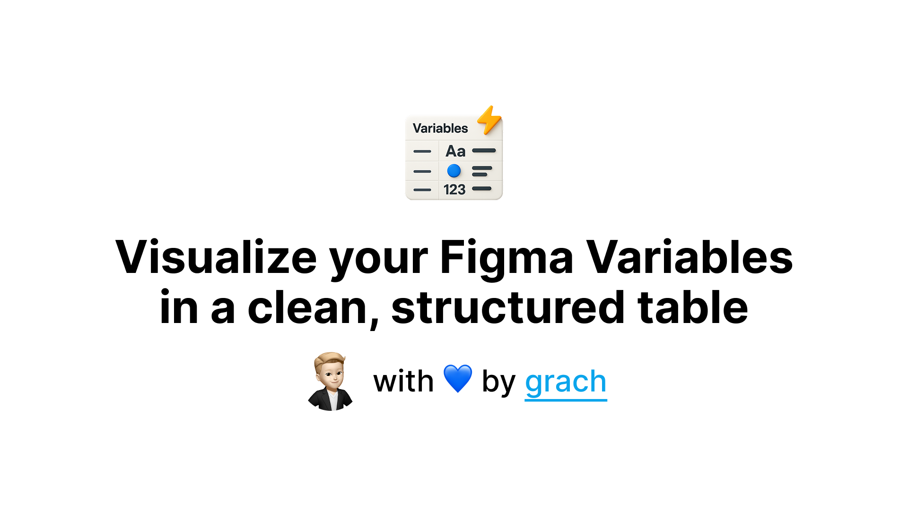

# Visualize your Figma Variables in a clean, structured table

This plugin transforms your Figma variables collections into structured, visual tables directly on your canvas. Whether you're documenting design tokens, creating handoff materials, or maintaining a design system, it automatically generates professional tables with proper grouping, color indicators, and CSS-ready dev tokens.

No manual table creation or copy-pasting values. Just select your variables collection, choose your groups, and get a formatted table that keeps your design tokens organized and accessible for both designers and developers.

- Auto-detect and group variables by prefixes
- Generate CSS custom properties for developers  
- Visual color swatches for color variables
- Support for all Figma variable types (Color, Number, String, Boolean)
- Handle multiple modes/themes seamlessly
- Smart alias resolution and formatting

Clean. Structured. Ready for handoff. All variables stay perfectly in sync with your design system.

